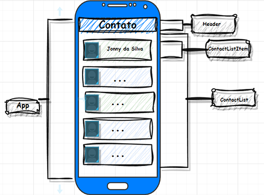

# App Pessoas

[](https://github.com/Carlos-Devico/app-pessoas/blob/main/LICENSE)

 Sobre o Projeto

 Projeto desenvolvido com fins de treinamento dos recurso do react native.

 A aplicação consiste em ...

 


 - Pré requisitos: Java 8 ou superior
 - JDK 

## Competências
```bash
 - JSX
 - Flex-Box
 - Lists and Keys React
 - integração com API
 - React Navigation
```


 # Tecnologias utilizadas
 
 ## Plataforma
 - Android Emulator (do Android Studio)
 - Expo (https://expo.dev/)
 ## Front end
 - Pré-requisito: npm / yarn
 - React-native

 ## Back end
 - Axios

##  Como rodar o projeto
```bash
# clonar o repositorio
git clone https://github.com/Carlos-Devico/app-contatos.git

# Na pasta principal do projeto 
 - cd app-contatos
 
 # Instalar as dependências necessárias
 - yarn install

 # Para executar no android emulator que ja deve estar rodando
 yarn run android

```
# Autor 
Carlos Vieira

https://www.linkedin.com/in/carlos-vico